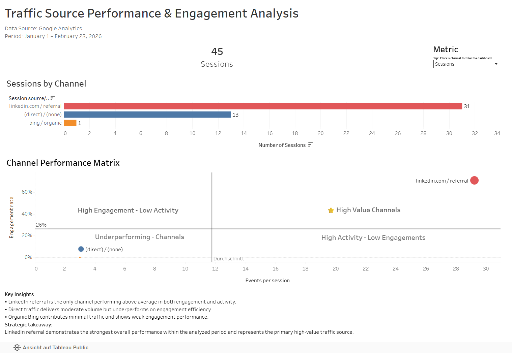

# 📊 Traffic Source Performance & Engagement Analysis (SQL + Tableau)

End-to-end marketing analytics project analyzing traffic sources,
engagement efficiency, and performance positioning using SQL and
Tableau.

🔗 **Live Dashboard (Tableau Public):**\
https://public.tableau.com/app/profile/yauheni.vesialukha/viz/TrafficSourcePerformanceAnalysisTableauPortfolio/TrafficSourcePerformanceEngagementAnalysis?publish=yes

------------------------------------------------------------------------

## 🚀 Project Overview

This project evaluates traffic channel performance using activity and
engagement metrics.

**Objectives:** - Identify high-value acquisition channels\
- Compare engagement efficiency across sources\
- Detect underperforming channels\
- Build a strategic performance matrix

-----------------------------------------------------------------------

## 🛠 Tech Stack

-   SQL (Data cleaning & KPI preparation)\
-   Window Functions\
-   CSV datasets\
-   Tableau (Interactive dashboard)\
-   Parameter-driven KPI selection\
-   Dashboard Filter Actions
-   Data aggregation & KPI benchmarking

------------------------------------------------------------------------

## 📂 Repository Structure

traffic-source-analysis/
 │ 
 ├── data/ 
 │    ├──  01_traffic_source_medium.csv
 │    ├──  02_events.csv 
 │    └──  03_events_by_source_clean.csv
 │ 
 ├── sql/ 
 │    ├──  01_schema_cleanup.sql 
 │    └──  02_analysis.sql 
 │ 
 ├── tableau/ 
 │    ├──  Traffic Source Performance Analysis.twbx 
 │    └──  screenshots/ 
 │
 └── README.md

------------------------------------------------------------------------

## 📈 Key Metrics

### Traffic Volume

-   Sessions\
-   Engaged Sessions

### Engagement

-   Engagement Rate\
-   Events per Session\
-   Key Events

### Performance Segmentation

-   Quadrant-based Channel Matrix\
-   Average benchmark comparison\
-   KPI switching via parameter

------------------------------------------------------------------------

## 📊 Dashboard Features

-   KPI selector (dynamic metric switching)\
-   Interactive filtering by traffic channel\
-   Channel Performance Matrix (Activity vs Engagement)\
-   Strategic quadrant classification:
    -   High Value Channels\
    -   High Engagement -- Low Activity\
    -   High Activity -- Low Engagement\
    -   Underperforming Channels

------------------------------------------------------------------------

## 🔍 Key Insights

-   LinkedIn referral outperforms other channels across engagement and
    activity.\
-   Direct traffic generates moderate volume but underperforms in
    engagement efficiency.\
-   Organic Bing contributes minimal traffic and shows weak
    performance.\
-   LinkedIn represents the strongest high-value acquisition source.

------------------------------------------------------------------------

## 🏗 SQL Workflow

1.  Data cleanup and source normalization\
2.  Aggregation of sessions and engagement metrics\
3.  KPI calculation per channel\
4.  Benchmark calculation (overall averages)\
5.  Final dataset preparation for Tableau

------------------------------------------------------------------------

## ▶ How to Reproduce

1.  Clone repository\
2.  Run SQL scripts from `/sql`\
3.  Use processed CSV files from `/data`\
4.  Open Tableau workbook (`.twbx`)\
5.  Explore interactive dashboard

------------------------------------------------------------------------

## 📌 Future Improvements

-   Add conversion rate analysis\
-   Integrate revenue attribution\
-   Time-series channel trends\
-   Cohort-based engagement comparison

------------------------------------------------------------------------

## 👤 Author

**Yauheni Vesialukha**\
Data Analyst \| SQL \| Tableau \| Marketing Analytics
